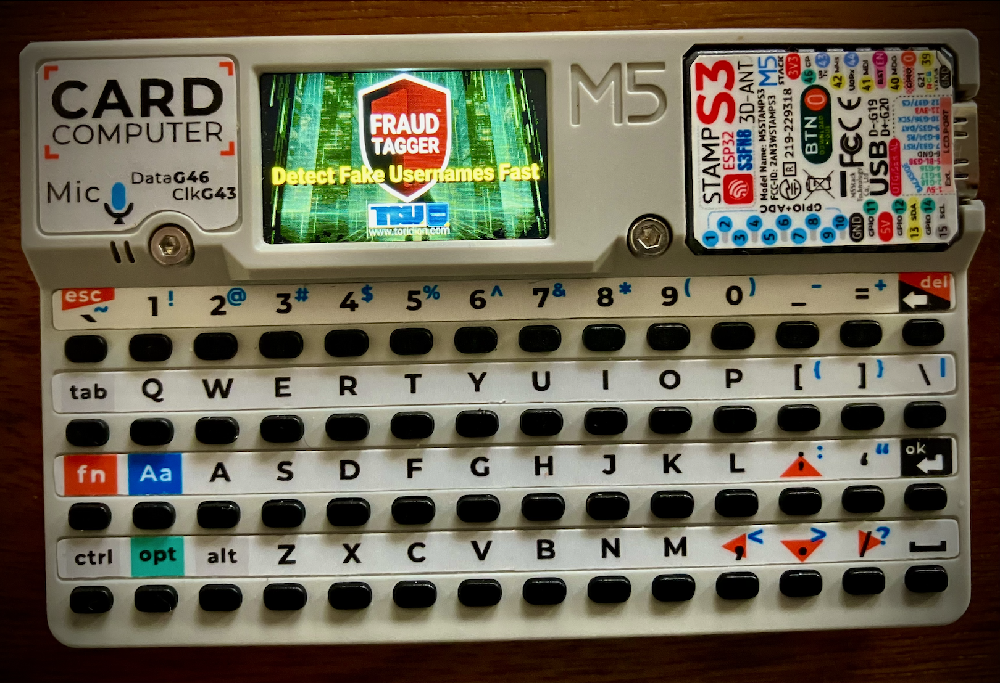

## ⌨️ M5Cardputer Fraud Detection with FraudTagger API ##

An application that uses M5Cardputer to access the FraudTagger ~1 Billion Token Foundation Model API. An enterprise grade ML model for scoring email usernames for traces of machine generation and fraudulence that other filters and blacklists miss. 

This project includes code for entering usernames with the keyboard, making API requests, and displaying scores on the M5Cardputer's screen. WiFi conbfiguration is manually achieved and requires an SD card.

## 🌟 Features 

⦿ **Email/Username scoring** against enterprise grade fraud detection API

⦿ **Free** to use upto 10 username searches per day

⦿ Use M5Cardputer to learn TQNN Fraudtagger API integration

## 📧 Further development 

The current version requires the user to manually edit fraudtagger.cfg - I will add interactive setup asap. 

## 📧 Instructions 

You can install FraudTagger for Cardputer directly from M5Burner or by compiling the .ino file in Arduino Studio and buring directly to your M5Cardputer. The app requires a **fraudtagger.cfg file on SD Card** along with a number of background images. If images are not found the app may display a balck screen. M5Burner will install images and files on SD Card at burn time. Afterward eject the card and edit fraudtagger.cfg with your WiFi credentials and optional API key. 

**note** the apiKey=<YOUR_API_KEY> entry MUST be present even if the key is not set. Replace <YOUR_API_KEY> with the supplied one from TORIDION if you have one.

## 🔐 Free API Usage & Fair Use

M5Cardputer-FraudTagger is free to use under the MIT license for personal, educational, and prototyping purposes.

The included Cardputer app connects to the hosted **FraudTagger API**, which is free to use for up to **10 email checks per day**.

Usage beyond this will require a valid API license key, please [view the API plans](https://toridion.com/fraudtagger) for license details for commercial use.

The source code may be modified and redistributed under the terms of the MIT license, but **abuse of the free API tier (e.g., illegal use, bulk use, bypassing limits or causing a nuisance to anyone)** may result in access being restricted without notice.

✅ TL;DR:
- You can use/modify/share the app
- API access is free up to 10/day
- For more, see [Pricing & Terms](https://toridion.com/fraudtagger)
